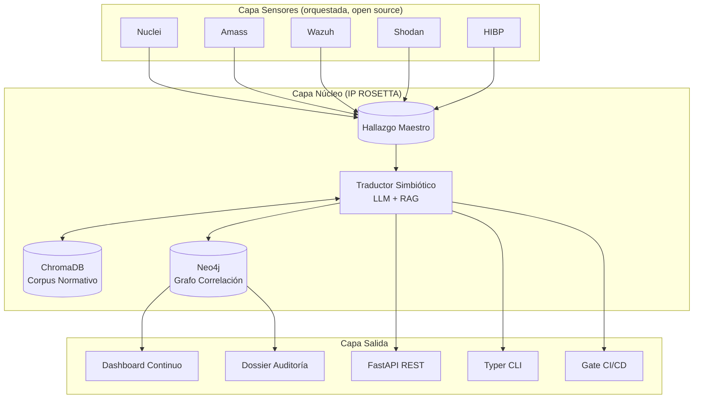

# Arquitectura de ROSETTA

> Este documento describe cómo está construido ROSETTA. Para el "qué hay que construir ahora" ver `ROADMAP.md`. Para decisiones históricas ver `adr/`.

---

## Principios rectores

1. **Orquestación sobre reimplementación.** ROSETTA no reinventa escáneres ni SIEMs. Los sensores open source ya son excelentes; el valor está en la capa que los une con la norma.
2. **Un único lenguaje común: el Hallazgo Maestro.** Todos los componentes se comunican mediante este objeto Pydantic. Si un módulo no produce o consume Hallazgos Maestros, revisar el diseño.
3. **RAG antes que razonamiento libre.** El LLM nunca inventa controles; solo razona sobre fragmentos normativos recuperados del corpus vectorial. Esto es lo que diferencia a ROSETTA de un prompt bonito.
4. **Trazabilidad extremo a extremo.** Todo hallazgo deja rastro en el grafo Neo4j: fuente, timestamp, control aplicado, justificación LLM, evidencia generada. Cumplimiento auditable por diseño.
5. **Multi-marco nativo.** Un hallazgo puede proyectar sobre varios marcos a la vez (ISO 27001 + ENS + NIS2). El razonamiento debe distinguir matices entre ellos.

## Diagrama de capas

## Flujo de datos canónico

1. Un **sensor** (ej. Nuclei) detecta algo sobre un activo en alcance autorizado.
2. El **adaptador** correspondiente normaliza la salida a `DatosRedTeam`.
3. Se crea un `HallazgoMaestro` y se pasa al `TraductorSimbiotico`.
4. El Traductor construye una query semántica y la envía al `NormativaRAG`.
5. El RAG devuelve los top-k fragmentos normativos relevantes, filtrados por los marcos activos.
6. El Traductor llama al LLM con system prompt + hallazgo + fragmentos recuperados + schema de salida.
7. El LLM devuelve `DatosCompliance`: controles incumplidos, cita, justificación, acción.
8. El `HallazgoMaestro` completo (Red + Compliance + opcionalmente Blue) se persiste en el grafo.
9. Se genera evidencia trazable y se notifica al dashboard y, si aplica, al gate de CI/CD.

## Componentes principales

### `rosetta.core.models`

Modelos Pydantic: `Severidad`, `FuenteRedTeam`, `MarcoNormativo`, `DatosRedTeam`, `DatosBlueTeam`, `DatosCompliance`, `HallazgoMaestro`. **Fuente de verdad** de los tipos que circulan por el sistema.

### `rosetta.core.traductor`

`TraductorSimbiotico`: orquesta LLM + RAG para producir `DatosCompliance` a partir de `DatosRedTeam`. System prompt duro anti-alucinación. Tool-use para forzar schema de salida.

### `rosetta.core.rag`

`NormativaRAG`: ingesta de corpus multi-marco en ChromaDB, segmentación por control/artículo, búsqueda filtrada por marco.

### `rosetta.core.graph`

`GrafoCorrelacion`: Neo4j como fuente de verdad relacional. Nodos: Activo, Hallazgo, Control, Marco, Procedimiento, Evidencia. Relaciones: AFECTADO_POR, INCUMPLE, PERTENECE_A, SATISFACE, REFERENCIA.

### `rosetta.adapters.*`

Adaptadores concretos para sensores externos. Heredan de `RedTeamAdapter` o `BlueTeamAdapter`. Orquestan vía CLI/API, nunca modifican la herramienta upstream.

### `rosetta.llm.claude`

Wrapper sobre el SDK oficial de Anthropic. Async. Soporta tool-use.

### `rosetta.api.main`

FastAPI con endpoints `/translate`, `/health`, `/findings`, `/compliance/frameworks`, `/compliance/evidence`.

### `rosetta.cli.main`

Typer CLI para operaciones interactivas: cargar corpus, traducir un JSON suelto, exportar dossier.

## Decisiones clave tomadas

Ver `docs/adr/`:

- **ADR-001**: Orquestación de open source sobre fork/reimplementación.
- (pendientes) ADR-002: Elección de ChromaDB como vectorstore MVP. ADR-003: Hallazgo Maestro como contrato entre capas. ADR-004: Claude como LLM por defecto. ADR-005: Incorporación de procedure drift.

## Qué queda explícitamente fuera de alcance

- **Desarrollo de capacidades ofensivas avanzadas**: no hay ni habrá código de evasión de EDR, bypass AMSI, shellcode, ofuscación de malware, C2 framework.
- **Escáneres propios**: no reimplementamos Nuclei, Nmap, Amass.
- **SIEM propio**: no reimplementamos Wazuh/Elastic.
- **Auditoría física**: cualquier control que requiera presencia humana o hardware dedicado.
