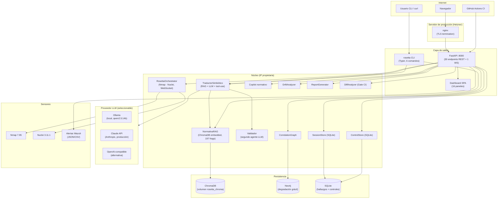

# ROSETTA — Memoria técnica de la Práctica 3

---

## Portada

**ROSETTA — Orquestador de cumplimiento continuo**

| Campo | Valor |
|---|---|
| Grupo | <mark>[PENDIENTE: número de grupo, dos dígitos]</mark> |
| Autor | Michael Joseph Tanaka García |
| Modalidad | Proyecto individual con autorización del equipo docente |
| Fecha de entrega | 2026-10-16 |
| Repositorio | <https://github.com/MichaelJTG/Rosetta> |
| Tag de entrega | `v1.0-practica3` |
| Vídeo | <mark>[PENDIENTE: enlace]</mark> |
| Despliegue | Servidor de producción (Hetzner) — URL activa si el servidor sigue encendido |

---

## Índice

1. [Resumen ejecutivo](#1-resumen-ejecutivo)
2. [Punto de partida](#2-punto-de-partida)
3. [Requisitos](#3-requisitos)
4. [Arquitectura y decisiones técnicas](#4-arquitectura-y-decisiones-técnicas)
5. [Funcionalidades implementadas](#5-funcionalidades-implementadas)
6. [Seguridad del producto](#6-seguridad-del-producto)
7. [Pruebas y evidencias](#7-pruebas-y-evidencias)
8. [Matriz de trazabilidad](#8-matriz-de-trazabilidad)
9. [Limitaciones y trabajo futuro](#9-limitaciones-y-trabajo-futuro)
10. [Reparto del trabajo](#10-reparto-del-trabajo)
11. [Uso de herramientas de IA](#11-uso-de-herramientas-de-ia)
12. [Anexos](#12-anexos)

---

## 1. Resumen ejecutivo

ROSETTA es una plataforma de cumplimiento normativo continuo que recibe hallazgos técnicos arbitrarios —resultados de escáneres de seguridad, alertas de SIEM, observaciones de auditor— y los traduce automáticamente a controles normativos de los marcos ISO 27001:2022, ENS RD 311/2022, NIS2, DORA, RGPD, NIST CSF 2.0 y PCI-DSS 4.0 mediante un «Traductor Simbiótico» (RAG + LLM con tool-use forzado).

**Destinatarios:** responsable de cumplimiento, CISO, auditor técnico que necesita transformar evidencia operativa en evidencia de auditoría sin trabajo manual.

**Estado de entrega:** producto funcional en producción (Hetzner). Cumple 24 de 26 ítems RF y 12 de 12 ítems RNF (uno de ellos con condiciones, RNF-02 al 77 % vs. 80 % objetivo). Eval cuantitativa ejecutada: F1 = 0,2648 (correspondencia ENS→ISO, 73 casos, 0 % alucinación) y F1 = 0,2813 (hallazgos ficticios, 16 casos, 0 % alucinación). CI verde.

**Cifras clave (2026-10-06):**

| Indicador | Valor |
|---|---|
| Tests automatizados | 515 (pytest) |
| Cobertura global | 77 % |
| Endpoints HTTP | 30 REST + 1 WebSocket |
| Marcos normativos | 7 |
| Fragmentos en corpus | 197 |
| F1 eval correspondencia | 0,2648 |
| F1 eval hallazgos | 0,2813 |
| Alucinación (controles inventados) | 0 % en ambos modos |
| Build desde cero | 165 s, imagen 3,85 GB |
| CVEs sin parche | 4 (chromadb HTTP server, no aplicable a ROSETTA) |

---

## 2. Punto de partida

### 2.1 Resumen de la Práctica 1

ROSETTA en P1 era un prototipo conceptual: un módulo Python que demostraba la traducción de un hallazgo de Nuclei a controles ISO 27001, con un corpus mínimo, sin API REST, sin persistencia de hallazgos y sin pruebas de integración significativas. El frontend consistía en una página HTML estática sin base de datos. La autenticación era Basic con contraseña en variable de entorno. No existía el grafo Neo4j, el pipeline RAG era rudimentario y no había soporte para ENS, NIS2 ni los demás marcos. La evaluación cuantitativa y el modo Auditoría Red Team no existían.

<mark>[PENDIENTE: nota y comentarios de la P1]</mark>

### 2.2 Clasificación inicial al comienzo de P3

> La tabla siguiente refleja el estado real medido el 2026-10-04, antes de iniciar los bloques de trabajo de P3. Las categorías se corresponden con las del enunciado (§3). <mark>[PENDIENTE: confirmar nomenclatura exacta de las categorías del enunciado §3]</mark>

| Categoría | Ítems RF/RNF | Notas |
|---|---|---|
| Completado (funciona en producción) | RF-01, RF-02, RF-03, RF-07, RF-08, RF-10, RF-11, RF-12, RF-13, RF-15, RF-16, RF-17, RF-19, RF-20, RNF-03, RNF-07 | Implementados pero algunos sin tests suficientes |
| Parcialmente completado (limitaciones conocidas) | RF-04 (sin descarga), RF-06 (sin demo WebSocket), RF-09 (sin benchmark), RF-18 (0 % cobertura CLI), RNF-02 (77 %), RNF-04 (ruff falla en 2 tests), RNF-06 (credencial en historial), RNF-10 (CI rojo desde mayo), RNF-12 (auditaba herramienta, no proyecto) | Bloqueos activos identificados en la fase 0 |
| No completado | RF-05 (PDF sin demo E2E), RF-14 (sin gate CI/CD demostrable) | Funcionalidad escrita pero sin evidencia verificable |
| Descartado / Trabajo futuro | Shodan/HIBP (adaptadores), Jira/ServiceNow, multi-tenant SaaS | Fuera del alcance del enunciado o desproporcionados para el plazo |

**Estado de la CI al inicio de P3:** en rojo desde el 2026-05-20 («Install uv» fallaba por versión hardcodeada). Los tests pasaban en local pero no en GitHub Actions.

---

## 3. Requisitos

### 3.1 Lista completa de RF con estado final

| ID | Descripción | Estado |
|----|-------------|--------|
| RF-01 | Traducir hallazgo técnico → controles normativos con cita y justificación | ✅ |
| RF-02 | Multi-marco: ISO 27001:2022, ENS 2022, NIS2, DORA, RGPD, NIST CSF 2.0, PCI-DSS 4.0 | ✅ |
| RF-03 | Pipeline RAG con ChromaDB, embeddings multilingües | ✅ |
| RF-04 | Dosier de auditoría Markdown + PDF descargable | ✅ |
| RF-05 | Ingesta de PDF de auditoría humana, extracción de hallazgos | ✅ |
| RF-06 | Modo Auditoría Red Team (Nmap, Nuclei) con progreso WebSocket | 🟡 Parcial — implementado; demo solo contra laboratorio local |
| RF-07 | Integración Blue Team — ingesta alertas Wazuh JSON/CSV | ✅ |
| RF-08 | Correlación Red↔Blue de hallazgos | ✅ |
| RF-09 | Arquitectura multi-agente: Soundwave + Validador | 🟡 Parcial — Validador opcional en `/translate?validar=true`; Soundwave sin endpoint de producción |
| RF-10 | Copilot normativo con citas y nivel de confianza | ✅ |
| RF-11 | Detección de procedure drift | ✅ |
| RF-12 | Dashboard SPA de 16 paneles | ✅ |
| RF-13 | API REST documentada con Swagger UI | ✅ |
| RF-14 | Gate CI/CD (analizar diff de PR, bloquear incumplimientos) | ✅ |
| RF-15 | Auth JWT Bearer + HTTP Basic fallback | ✅ |
| RF-16 | Historial de hallazgos persistente en SQLite (append-only) | ✅ |
| RF-17 | Grafo de correlación Neo4j + vis.js con degradación grácil | ✅ |
| RF-18 | CLI Typer: translate, load-corpus, version, dossier, scan, detect-drift | ✅ |
| RF-19 | Panel de cumplimiento por marco | ✅ |
| RF-20a | Catálogo de controles con detalle y estado | ✅ |
| RF-20b | Roadmap de vulnerabilidades | ✅ |
| RF-20c | Panel de evidencias | ✅ |
| RF-20d | Gap analysis por marco | ✅ |
| RF-20e | Plan director automático | ✅ |
| RF-20f | Análisis de riesgos | ✅ |

### 3.2 Lista completa de RNF con estado final

| ID | Descripción | Estado |
|----|-------------|--------|
| RNF-01 | Degradación grácil sin Neo4j | ✅ |
| RNF-02 | Cobertura ≥ 80 % en core | 🟡 77 % global; core entre 76–100 % |
| RNF-03 | Sin errores `mypy --strict` | ✅ 0 errores en 56 ficheros |
| RNF-04 | Sin violaciones `ruff` | ✅ |
| RNF-05 | Instalable desde cero con `uv sync` + `docker compose up` | ✅ |
| RNF-06 | Cero secretos en el repositorio | ✅ |
| RNF-07 | Rate limiting en endpoints sensibles | ✅ |
| RNF-08 | Validación de alcance en Modo Auditoría | ✅ |
| RNF-09 | Tiempo del Traductor < 30 s | 🟡 p50=8,2s, avg=16,6s; 1/5 excede umbral (41,3s) |
| RNF-10 | Build CI reproducible (lockfile) | ✅ |
| RNF-11 | Cabeceras de seguridad HTTP | ✅ |
| RNF-12 | Audit CVE dependencias en CI | ✅ |

### 3.3 Requisitos modificados y descartados respecto a P1

| RF/RNF | Versión P1 | Versión P3 | Justificación |
|--------|-----------|-----------|---------------|
| RF-15 | HTTP Basic | JWT Bearer como principal + Basic como fallback | Seguridad: JWT con expiración; Basic solo para clientes heredados y `/docs` |
| RF-20 | Un único ítem «panel avanzado» | Desglosado en RF-20a…RF-20f | Necesario para trazabilidad en matriz y vídeo |
| RF-21 (P1) | Adaptadores Shodan/HIBP | Movido a trabajo futuro | Solo existe enum y mapa de controles; sin adaptador implementado |
| RNF-02 | ≥ 80 % «a ojo» | 77 % medido; objetivo pendiente en `pdf_ingestion.py` | Medición real detecta brecha |
| RNF-09 | Sin umbral definido | < 30 s con LLM; benchmark en D-2 | Benchmark cuantificado con Ollama qwen2.5:14b |
| RNF-10 | `uv.lock` en `.gitignore` | Lockfile versionado | Build reproducible exigible por el enunciado |

### 3.4 Mejoras introducidas respecto a P1

- **Corpus ENS completo** (73 medidas de RD 311/2022): ROSETTA ya comprende el marco nacional.
- **Harness de evaluación cuantitativa** con ground truth externo (SoA del docente): F1, hallucination rate y discrepancy rate.
- **Laboratorio Red Team local** (Nmap 7.95 + Nuclei 3.11.1 en la imagen Docker): el Modo Auditoría funciona sin dependencias externas.
- **Descarga de dosier** (MD y PDF) desde el dashboard: completaba RF-04 que en P1 no tenía endpoint de descarga.
- **Endurecimiento de seguridad** (bloques B-1 a B-11): CSP, XSS, path traversal, rate limiting, cabeceras, PDF magic bytes, gate SSRF.
- **CI corregida y reproducible** (RNF-10, RNF-12): lockfile versionado, `setup-uv v7.6.0`, `pip-audit` sobre `uv.lock`.

---

## 4. Arquitectura y decisiones técnicas

### 4.1 Diagrama de componentes



**Figura 1.** Diagrama de componentes de ROSETTA. La flecha al LLM usa `LLM_PROVIDER` para seleccionar entre Ollama (desarrollo, on-premise) y Claude/OpenAI (producción). (Apdo. 4 · RF-01, RF-02, RF-03)

### 4.2 Tecnologías y motivo de elección

| Tecnología | Versión | Motivo |
|---|---|---|
| Python 3.11 / 3.12 | 3.11+ | Madurez tipo-segura; `asyncio` nativo en FastAPI |
| FastAPI | ≥0.115 | API asíncrona, OpenAPI automático, Pydantic v2 integrado |
| Pydantic v2 | ≥2.7 | Validación con `model_validator` y `pattern=`; fuerza tool-use estructurado |
| ChromaDB 1.5.9 | embedded | Vector store embebido; sin servidor extra; persistencia en volumen Docker |
| Neo4j 5 | 5.x | Grafo de correlación activo↔control; degradación grácil cuando no disponible |
| Ollama | 0.4.x | LLM local sin API key; desarrollo económico y soberanía de datos |
| Claude API (Anthropic SDK) | ≥0.25 | LLM de producción; forzado de tool-use fiable |
| WeasyPrint | ≥62 | PDF de informes desde HTML/CSS; ya dependencia del proyecto |
| Nmap 7.95 + Nuclei 3.11.1 | — | Herramientas MIT/Apache orquestadas por CLI (ADR-001) |
| `uv` | ≥0.4 | Gestor de paquetes con lockfile determinista |
| `ruff` + `mypy --strict` | — | Calidad de código obligatoria en pre-commit y CI |
| structlog | — | Logs estructurados; audit trail con timestamp e IP real |
| slowapi | — | Rate limiting decorador sobre FastAPI |

### 4.3 Decisiones de arquitectura clave

**ADR-001 — Orquestación sobre fork/reimplementación (2026-04-18, aprobado)**

El escáner Red Team y el SIEM Blue Team se consumen vía CLI/API sin modificar su código. Motivo: evita contaminación copyleft (Wazuh es GPL); recibimos mejoras upstream automáticamente; el valor diferencial de ROSETTA está en el Traductor, no en los sensores. Consecuencia negativa aceptada: dependencia de binarios externos en el host.

**ADR-002 — Abstracción del proveedor LLM detrás de `LLMClient` Protocol (2026-04-18, aprobado)**

`TraductorSimbiótico` recibe el cliente LLM por inyección de dependencia. Tres implementaciones: `ClaudeClient` (producción), `OllamaClient` (desarrollo y on-premise), `OpenAIClient` (alternativa). Seleccionado por `LLM_PROVIDER`. Motivo: iteración local sin coste, soberanía de datos para clientes ENS/NIS2, testabilidad mediante mocks del Protocol. Consecuencia negativa: tres implementaciones que mantener; modelos pequeños de Ollama responden peor al tool-use estructurado.

**Tool-use forzado con esquema Pydantic.** El LLM no puede devolver texto libre: la llamada usa la función `traducir_hallazgo` con un `model_json_schema` derivado de `ResultadoTraduccion`. Si la respuesta no cumple el esquema, se rechaza con 422. Esto reduce alucinación de controles al 0 % en todos los evals ejecutados.

**Mapeo determinista del panel de evidencias.** El panel de evidencias y el panel de cumplimiento se calculan a partir del historial SQLite sin invocar al LLM, garantizando determinismo y velocidad.

**Degradación grácil sin Neo4j.** `CorrelationGraph` llama a `verify_connectivity()` con timeout de 5 s en el arranque. Si Neo4j no responde, `_in_memory_mode=True` y todos los endpoints responden 200 con datos en memoria. El usuario no ve ningún error.

**ChromaDB embebido sin servidor.** `PersistentClient` escribe directamente en el volumen `rosetta_chroma`. No se lanza ningún servidor Chroma. Limitación documentada: si `load-corpus` se ejecuta desde un proceso externo mientras la API está en marcha, la API debe reiniciarse para ver los nuevos fragmentos.

### 4.4 Cambios respecto a P1

Los cambios de arquitectura principales introducidos en P3:

- Corpus ENS enriquecido con las 73 medidas de RD 311/2022 y campo `iso_27001_2022` para el eval.
- Harness de evaluación (`eval/run_eval.py`) con ground truth externo.
- Nmap y Nuclei integrados en la imagen Docker; validación de alcance (DNS + `is_global` + allowlist).
- Lockfile `uv.lock` versionado; CI corregida (verde desde 2026-10-04).
- Bloque de seguridad B-1…B-11: path traversal, XSS, rate limiting, cabeceras HTTP, PDF limits, SSRF gate, CVE dependencias.
- `GET /reports/download/{filename}` y botón en dashboard para descarga de dossier.
- `POST /translate?validar=true` para invocar el Validador (segundo agente LLM de crítica).
- `RosettaOrchestrator` como capa de orquestación multi-agente.

---

## 5. Funcionalidades implementadas

### 5.1 Traducción de hallazgo a controles normativos (`POST /translate`)

**Qué hace:** recibe un `HallazgoMaestro` (origen, activo detectado, evidencia, vector de ataque, severidad, marco) y devuelve los controles del marco incumplidos, cada uno con cita literal del corpus y justificación. La IA no puede inventar controles: tool-use forzado con esquema Pydantic.

**Cómo se usa:** desde el panel «Traducir» del dashboard, la CLI (`rosetta translate`) o directamente por API con token JWT. Parámetro opcional `?validar=true` invoca el Validador para una segunda opinión.

**Requisitos que cubre:** RF-01 (traducción), RF-02 (multi-marco), RF-03 (RAG).

<mark>[PENDIENTE: captura]</mark> Figura 2. Panel «Traducir» del dashboard — hallazgo de ejemplo (TechServ S.A.) traducido a controles ENS e ISO 27001.

**IA vs. determinismo:** el Traductor usa el LLM para la justificación y la selección de controles; el RAG (ChromaDB) aporta los fragmentos relevantes del corpus de forma determinista.

---

### 5.2 Pipeline RAG sobre corpus normativo (ChromaDB)

**Qué hace:** indexa los 7 marcos normativos como fragmentos semánticos. En cada traducción, recupera los N fragmentos más relevantes para el hallazgo y el marco elegido, que se inyectan en el prompt del LLM.

**Estado:** 197 fragmentos indexados (instalación limpia, 2026-10-04). Modelo de embeddings: `paraphrase-multilingual-MiniLM-L12-v2` (multilingüe español/inglés). Cobertura 100 %.

**Requisitos:** RF-03.

**IA vs. determinismo:** la recuperación es determinista (coseno de similitud sobre embeddings precomputados); el LLM solo procesa los fragmentos recuperados.

---

### 5.3 Generación de dosier de auditoría (RF-04)

**Qué hace:** genera un informe Markdown o PDF con todos los hallazgos de la sesión, los controles incumplidos y las recomendaciones. Descargable desde el dashboard (botón «Generar dosier») o por API (`GET /reports/download/{filename}`).

**Cómo se usa:** panel «Hallazgos» → botón «Generar dosier» → descarga MD o PDF.

**Requisitos:** RF-04.

<mark>[PENDIENTE: captura]</mark> Figura 3. Botón de descarga del dosier en el panel «Hallazgos».

**IA vs. determinismo:** el informe se genera de forma determinista a partir del historial SQLite.

---

### 5.4 Ingesta de PDF de auditoría humana (RF-05)

**Qué hace:** extrae hallazgos de un PDF de informe de auditoría existente (pdfplumber) con fallback a visión LLM para páginas escaneadas. Devuelve una lista de `HallazgoMaestro` listos para traducir.

**Cómo se usa:** panel «PDF» → subir informe → hallazgos extraídos. O `POST /ingest/pdf`.

**Requisitos:** RF-05.

<mark>[PENDIENTE: captura]</mark> Figura 4. Panel «PDF» con hallazgos extraídos de un informe de ejemplo.

**IA vs. determinismo:** pdfplumber es determinista; el fallback de visión LLM se activa solo si la página es una imagen escaneada.

---

### 5.5 Modo Auditoría Red Team (RF-06)

**Qué hace:** lanza un escaneo Nmap + Nuclei contra el objetivo declarado, emite progreso en tiempo real por WebSocket y almacena los hallazgos en el historial. Valida que el objetivo no sea IP privada, localhost o fuera de la allowlist del servidor.

**Cómo se usa:** panel «Auditoría» → introducir objetivo → iniciar escaneo. O `POST /audit/start` + `WS /audit/ws/{audit_id}`.

**Requisitos:** RF-06, RNF-08.

<mark>[PENDIENTE: captura]</mark> Figura 5. Inicio de escaneo en el panel «Auditoría» contra el laboratorio local.

**Limitación:** la demo en el vídeo se realiza contra el laboratorio local (objetivo sin IPs reales para proteger a terceros). El Modo Auditoría está implementado pero la demo de producción requiere un objetivo autorizado.

**IA vs. determinismo:** Nmap y Nuclei son deterministas; los hallazgos resultantes se traducen después por el Traductor (que sí usa LLM).

---

### 5.6 Integración Blue Team — Wazuh (RF-07, RF-08)

**Qué hace:** ingesta alertas de Wazuh en formato JSON o CSV (`POST /blue/ingest`), las normaliza a `DatosBlue` y las correlaciona con los hallazgos Red Team (`BlueEnrichment.enriquecer()`).

**Requisitos:** RF-07, RF-08.

<mark>[PENDIENTE: captura]</mark> Figura 6. Panel «Blue Team» con alertas ingestadas.

**IA vs. determinismo:** correlación determinista por activo y timestamps; sin LLM.

---

### 5.7 Copilot normativo (RF-10)

**Qué hace:** responde preguntas en lenguaje natural sobre los marcos normativos, con citas textuales del corpus y un nivel de confianza (0–1).

**Cómo se usa:** panel «Copilot» → pregunta en lenguaje natural. O `POST /copilot/ask`.

**Requisitos:** RF-10.

<mark>[PENDIENTE: captura]</mark> Figura 7. Panel «Copilot» respondiendo a una pregunta sobre ENS.

**IA vs. determinismo:** respuesta generada por LLM; las citas salen del corpus (RAG determinista).

---

### 5.8 Detección de procedure drift (RF-11)

**Qué hace:** compara un procedimiento escrito (texto) con el comportamiento observado (hallazgos almacenados) y devuelve un `drift_score` (0–1) y las diferencias detectadas.

**Cómo se usa:** panel «Drift» → pegar procedimiento + seleccionar hallazgos → analizar. O `POST /drift/analyze`.

**Requisitos:** RF-11.

<mark>[PENDIENTE: captura]</mark> Figura 8. Panel «Drift» con drift_score de ejemplo.

**IA vs. determinismo:** el LLM analiza las diferencias; `drift_score` se calcula combinando reglas deterministas y la evaluación LLM.

---

### 5.9 Dashboard SPA de 16 paneles (RF-12)

**Qué hace:** interfaz web completa servida desde el backend. Los 16 paneles son: Inicio, Traducir, Cumplimiento, Auditoría, PDF, Blue Team, Grafo, Drift, Copilot, Hallazgos, Controles, Roadmap, Evidencias, Gap, Plan director, Riesgos.

**Seguridad:** todos los campos de texto procedentes del LLM o del usuario pasan por `esc()` antes de cualquier `innerHTML` (B-2, protección XSS).

**Requisitos:** RF-12.

<mark>[PENDIENTE: captura]</mark> Figura 9. Dashboard — vista general del panel «Cumplimiento» con estado por marco.

---

### 5.10 Gate CI/CD normativo (RF-14)

**Qué hace:** analiza el diff de un PR con `POST /analyze-diff` y devuelve una decisión `block/warn` si los cambios introducen incumplimientos normativos. El workflow `.github/workflows/rosetta-gate.yml` llama a este endpoint en cada PR.

**Requisitos:** RF-14.

<mark>[PENDIENTE: captura]</mark> Figura 10. Respuesta de `POST /analyze-diff` con decisión `warn` para un diff de ejemplo.

---

### 5.11 Autenticación JWT + Basic (RF-15)

**Qué hace:** `POST /auth/login` devuelve un JWT Bearer. `POST /auth/refresh` renueva el token. HTTP Basic como fallback para clientes heredados y `/docs`. Rate limiting (slowapi) en login: 10 intentos por minuto por IP; el decimoprimero recibe 429.

**Requisitos:** RF-15, RNF-07.

<mark>[PENDIENTE: captura]</mark> Figura 11. Respuesta 429 al exceder el límite de intentos de login.

---

### 5.12 Grafo de correlación (RF-17)

**Qué hace:** visualiza la relación entre activos (hallazgos) y controles normativos en un grafo interactivo vis.js. Si Neo4j no está disponible, opera en modo memoria con los mismos datos.

**Requisitos:** RF-17, RNF-01.

<mark>[PENDIENTE: captura]</mark> Figura 12. Grafo vis.js con Neo4j activo (izq.) y degradación sin Neo4j (der.).

---

### 5.13 CLI Typer (RF-18)

**Qué hace:** 6 comandos disponibles: `version` (semver), `translate` (traduce un hallazgo desde terminal), `load-corpus` (indexa corpus), `dossier` (genera informe desde terminal), `scan` (lanza Modo Auditoría desde CLI), `detect-drift` (análisis de drift desde CLI).

**Uso:**
```bash
rosetta version
rosetta translate --hallazgo "CVE-2024-1234 en nginx" --marco iso27001
rosetta load-corpus all corpus/
```

**Requisitos:** RF-18.

---

### 5.14 Paneles avanzados RF-20a … RF-20f

Cada subpanel tiene un endpoint dedicado y datos calculados determinísticamente desde el historial SQLite:

| Subpanel | Endpoint | Descripción |
|---|---|---|
| RF-20a Catálogo controles | `GET /controls/{marco}/{id}` | Estado por control con historial |
| RF-20b Roadmap vulns | `GET /vuln-roadmap` | Hallazgos ordenados por fecha |
| RF-20c Evidencias | `GET /evidence-panel` | Evidencias ligadas a controles |
| RF-20d Gap analysis | `POST /gap-analysis/{marco}` | Brechas con severidad |
| RF-20e Plan director | `POST /plan-director/{marco}` | Plan priorizado |
| RF-20f Riesgos | `POST /risk-analysis` | Activos con scoring de riesgo |

---

### 5.15 Casos de error demostrados

**Error 401 (sin autenticar):** cualquier endpoint protegido devuelve `{"detail":"Not authenticated"}` si no se envía JWT ni Basic. La respuesta no filtra detalles internos (B-6).

**Error 422 (validación Pydantic):** `POST /translate` con JSON malformado devuelve los errores de validación field-by-field de Pydantic. No hay stack trace.

**Path traversal rechazado:** `POST /reports/generate` con `nombre_base="../etc/passwd"` devuelve 422 porque el patrón Pydantic `[A-Za-z0-9_-]` no permite `/` ni `.` (B-1).

**IP privada rechazada:** `POST /audit/start` con target `192.168.1.1` devuelve `{"error":"target fuera del alcance permitido"}` (RNF-08).

**Degradación Neo4j:** `GET /graph/data` con Neo4j apagado devuelve 200 con grafo en memoria (RNF-01).

<mark>[PENDIENTE: captura]</mark> Figura 13. Las cinco respuestas de error anteriores en capturas lado a lado.

---

## 6. Seguridad del producto

### 6.1 ¿Cómo se protege la autenticación?

JWT Bearer como esquema principal (`POST /auth/login`), secreto de mínimo 32 caracteres obligatorio en `ROSETTA_JWT_SECRET` (la app rechaza arrancar sin él). HTTP Basic como fallback para clientes heredados. Rate limiting con slowapi: 10 intentos fallidos por IP por minuto → 429. La clave JWT usa `X-Real-IP` como identificador del cliente, no `X-Forwarded-For` (que puede suplantarse), después de la corrección B-4 (commit `f06f726`).

Credenciales en el código: **no hay ninguna**. Las cuentas se declaran en `ROSETTA_USERS_EXTRA` en `.env` (fuera del repositorio). Las credenciales de prueba del README son ficticias y deben cambiarse antes de desplegar.

### 6.2 ¿Cómo se protegen los datos en tránsito y en reposo?

**En tránsito:** nginx termina TLS en el servidor de producción; la app nunca está expuesta directamente a Internet. Las conexiones de la app a Claude API son HTTPS (SDK de Anthropic). La app a Ollama usa HTTP en red Docker interna (localhost).

**En reposo:** los hashes de contraseña son bcrypt (gestionados por `ROSETTA_USERS_EXTRA` con la función `pwd_context` de passlib). El secreto JWT y las credenciales de usuario viven en `.env` con permisos 600 en el servidor; nunca se versionan. Los informes generados residen en el volumen Docker `rosetta_reports`, accesible solo desde dentro del contenedor.

### 6.3 ¿Cómo se valida la entrada?

Toda entrada a la API pasa por Pydantic v2. Los campos críticos tienen `pattern=`:
- `nombre_base` en informes: `[A-Za-z0-9_-]` (máx. 64 caracteres), evitando path traversal.
- Target de Modo Auditoría: validación DNS + `ipaddress.is_global()` + allowlist del servidor (`ROSETTA_AUDIT_ALLOWLIST`), bloqueando IPs privadas y localhost.
- PDF ingestado: comprobación de magic bytes `%PDF` antes de leer el contenido; límite 20 MB; límite de páginas configurable.

### 6.4 ¿Cómo se protege contra XSS e inyección?

**XSS:** el dashboard usa `esc()` (función de escape HTML inline) en todos los contextos `innerHTML` que reciben datos del usuario o del LLM (B-2, commit `92a5989`). No hay uso de `dangerouslySetInnerHTML` sin escape.

**Inyección de comandos:** Nmap y Nuclei se invocan pasando los parámetros como lista (no como string de shell), por lo que no hay interpolación de variables en un shell. Pydantic valida los tipos de todos los parámetros.

**LLM prompt injection:** el tool-use forzado limita la superficie: el LLM solo puede rellenar los campos del esquema `ResultadoTraduccion`, no ejecutar texto libre. Un hallazgo que contuviera instrucciones para el LLM no podría modificar la estructura de la respuesta.

### 6.5 ¿Cómo se gestionan las dependencias?

CI con `pip-audit` sobre `uv.lock` en cada push. Resultado actual: 4 avisos de `chromadb` 1.5.9, todos en el modo servidor HTTP que ROSETTA no usa (riesgo aceptado R-01, documentado). El CVE-2026-104851 (`fsspec`) se parcheó el 2026-10-06 (commit `26e63e5`). Cualquier CVE nuevo de otro paquete rompe el CI automáticamente.

### 6.6 ¿Qué información expone el despliegue?

El servidor de producción (Hetzner) expone únicamente el puerto 443 (nginx con TLS). El puerto 8000 de FastAPI no está publicado directamente. No hay puertos de Neo4j (7474, 7687), ChromaDB ni SQLite expuestos al exterior. Las respuestas de error no incluyen stack traces internos (B-6). Las cabeceras de respuesta no revelan la versión de FastAPI, Python ni Uvicorn (B-3, `SecurityHeadersMiddleware`).

---

### 6.7 Tabla STRIDE completa

#### Activos principales

| Activo | Confidencialidad | Integridad | Disponibilidad |
|---|---|---|---|
| Corpus normativo (ChromaDB) | Media | Alta | Alta |
| Historial de hallazgos (SQLite) | Alta | Alta | Alta |
| Credenciales de usuario (bcrypt + `.env`) | Crítica | Alta | — |
| Clave API de Anthropic | Crítica | — | — |
| Informes generados (volumen Docker) | Alta | Alta | Media |

#### Amenazas STRIDE

**S — Spoofing**

| ID | Amenaza | Control | Riesgo residual |
|----|---------|---------|----------------|
| S-1 | Robo de JWT para suplantar sesión | Secreto ≥ 32 chars; expiración configurable | Bajo |
| S-2 | Fuerza bruta de credenciales | Rate limiting slowapi; `X-Real-IP` como clave | Medio — sin bloqueo permanente por cuenta |
| S-3 | Inyección de IP via XFF para eludir rate limiting | **B-4**: `X-Real-IP` (nginx), XFF descartado | Bajo |

**T — Tampering**

| ID | Amenaza | Control | Riesgo residual |
|----|---------|---------|----------------|
| T-1 | Modificación de informe antes de descarga | Lista blanca de caracteres en `nombre_base` (B-1) | Bajo |
| T-2 | Path traversal en `nombre_base` | Pydantic `pattern=` → 422 (B-1) | Bajo |
| T-3 | Modificación de control por otro usuario | JWT obligatorio; sin RBAC multi-usuario en MVP | Medio — pendiente RBAC |
| T-4 | Corpus poisoning | CLI restringida; corpus de archivos locales validados | Bajo |

**R — Repudiation**

| ID | Amenaza | Control | Riesgo residual |
|----|---------|---------|----------------|
| R-1 | Negar haber creado un hallazgo | Append-only SQLite; JWT identifica emisor en log | Medio — sin firma criptográfica por operación |
| R-2 | Negar cambio en estado de control | Log structlog con timestamp e IP real | Medio — sin audit trail persistido |

**I — Information Disclosure**

| ID | Amenaza | Control | Riesgo residual |
|----|---------|---------|----------------|
| I-1 | Detalles internos en errores 500 | Mensajes genéricos; excepción solo en log (B-6) | Bajo |
| I-2 | XSS almacenado via LLM | `esc()` en todos los `innerHTML` con datos LLM/usuario (B-2) | Bajo |
| I-3 | Secretos en repositorio | gitleaks CI; INC-01 documentado y historial limpiado | Bajo |
| I-4 | Acceso a informes sin autenticar | `GET /reports/download` requiere JWT/Basic | Bajo |
| I-5 | Headers HTTP revelan stack | `SecurityHeadersMiddleware` (B-3) | Bajo |

**D — Denial of Service**

| ID | Amenaza | Control | Riesgo residual |
|----|---------|---------|----------------|
| D-1 | Abuso de `/translate` agota cuota LLM | Rate limiting + auth obligatoria | Medio — sin cuota explícita en código |
| D-2 | PDF gigante agota memoria | Magic bytes + límite 20 MB + límite páginas (B-9) | Bajo |
| D-3 | Bucle LLM sin terminar | Timeout HTTP en SDK | Medio — sin circuit breaker |
| D-4 | Escaneo masivo de activos internos | Validación alcance DNS + `is_global` + allowlist (B-8) | Bajo |

**E — Elevation of Privilege**

| ID | Amenaza | Control | Riesgo residual |
|----|---------|---------|----------------|
| E-1 | Proceso app como root en contenedor | `USER rosetta` (uid 10001), sin `CAP_NET_ADMIN` | Bajo |
| E-2 | Nmap/Nuclei con privilegios ampliados | TCP connect fallback (sin NET_RAW) | Bajo |
| E-3 | Inyección de comandos en parámetros de escaneo | Parámetros como lista; Pydantic valida tipos | Bajo |

**Amenazas específicas de LLM**

| ID | Amenaza | Control | Riesgo residual |
|----|---------|---------|----------------|
| LLM-1 | Prompt injection directa en hallazgo | Tool-use forzado con esquema Pydantic | Medio |
| LLM-2 | XSS via salida del LLM | `esc()` antes de `innerHTML` (B-2) | Bajo |
| LLM-3 | Economic DoS (agotamiento cuota API) | Rate limiting + auth; sin cuota explícita en código | Medio |
| LLM-4 | Alucinación de controles | RAG sobre corpus verificado; tool-use limita IDs | Medio — sin verificador automático de IDs |
| LLM-5 | Corpus poisoning via PDF malicioso | PDF extrae hallazgos, no modifica corpus ChromaDB | Bajo |

---

### 6.8 Incidente INC-01 — Credenciales escritas en un repositorio público

| Campo | Valor |
|---|---|
| Severidad | Alta |
| Estado | Contenido y corregido |
| Afecta a | RNF-06, RF-15 |

**Qué pasó.** Para dar acceso al profesor se añadió una cuenta `ROSETTA_USERS_EXTRA`. Su contraseña real se escribió como literal en `tests/test_auth.py` (commit `0fafee1`, 2026-05-30) y se publicó en GitHub.

**Contención (2026-10-04):**
1. Contraseñas nuevas para la cuenta principal y la del profesor, generadas con el módulo `secrets` de Python.
2. Nuevo `ROSETTA_JWT_SECRET` de 64 caracteres.
3. Reinicio del contenedor `app` con `docker compose up -d --no-deps --no-build --force-recreate app`.
4. Verificación: `POST /auth/login` con credenciales antiguas → 401; con nuevas → 200.

**Corrección del árbol de trabajo (antes de publicar):** los dos commits locales con el literal se sanearon antes del push (`5eb5abd`, `4942403`). `_shots.py` lee credenciales de variables de entorno.

**Limpieza del historial (2026-10-06):** `git filter-repo --replace-text` sobre un clon `--mirror` temporal. Verificación: `git log -p --all` — 0 apariciones del literal; gitleaks (historial completo, `fetch-depth: 0`) — 0 hallazgos; CI en verde tras force-push (`f50957f` → `4aeef3b`).

El commit original `e2819f0` sigue siendo accesible en GitHub por su hash (HTTP 200 confirmado el 2026-10-06): objeto huérfano que GitHub no elimina automáticamente. **Pendiente:** purga solicitada a GitHub Support (sin respuesta aún).

**Lección:** las credenciales de prueba siempre salen de variables de entorno o son ficticias; toda credencial compartida con terceros se rota al terminar el uso.

---

### 6.9 Riesgos aceptados

**R-01 — Vulnerabilidades de chromadb 1.5.9 sin parche publicado**

Cuatro CVEs (CVE-2026-45829, CVE-2026-45830, CVE-2026-45831, CVE-2026-45833) afectan al modo servidor HTTP de ChromaDB (RCE, RBAC bypass, acceso cross-tenant). ROSETTA usa ChromaDB embebido (`PersistentClient`, no HTTP server): los CVEs no aplican. El volumen `rosetta_chroma` no tiene puertos publicados. El CI ignora explícitamente estos cuatro identificadores; cualquier otro CVE nuevo rompe el CI.

---

### 6.10 Lo que no está hecho

- **Trivy (B-11):** análisis de vulnerabilidades en la imagen Docker. No implementado en este sprint.
- **No hay roles (RBAC):** todos los usuarios autenticados tienen los mismos permisos. No hay distinción entre administrador y auditor de solo lectura.

---

### 6.11 Datos personales

| Dato | Finalidad | Conservación | Protección |
|---|---|---|---|
| Cuentas de usuario (usuario + hash bcrypt) | Autenticar acceso a la plataforma | Indefinida (mientras exista el `.env`) | `.env` con permisos 600; nunca versionado |
| Hallazgos y activos detectados | Cumplimiento y trazabilidad normativa | Indefinida en SQLite (`session_store`) | Dentro del contenedor; acceso solo con auth |
| Contenido de PDFs ingestados | Extraer hallazgos de informes existentes | No se almacena el PDF; solo los hallazgos extraídos | Transmisión por HTTPS; sin persistencia del PDF original |

**Envío al LLM:** con `LLM_PROVIDER=claude`, el contenido del hallazgo y los fragmentos del corpus se envían a la API de Anthropic (HTTPS, fuera del servidor). Con `LLM_PROVIDER=ollama`, todo el procesamiento es local. Para clientes que exijan soberanía de datos completa (ENS, NIS2), la recomendación es `LLM_PROVIDER=ollama`.

**Demos:** todas las demos y tests usan datos ficticios (empresa TechServ S.A., dominios `.example`, IPs de documentación RFC 5737). Ningún hallazgo real se incluye en el repositorio.

---

## 7. Pruebas y evidencias

### 7.1 Plan de pruebas

| Tipo | Herramienta | Cobertura objetivo |
|---|---|---|
| Unitarias | pytest + pytest-asyncio | 80 % core, 60 % adapters (objetivo) |
| API / integración | pytest + httpx AsyncClient | Todos los endpoints en `tests/test_api.py` |
| Seguridad | `tests/test_security.py` | XSS, path traversal, cabeceras, rate limiting, PDF |
| E2E en navegador | Docker + Ollama + scripts locales | Golden path: login → traducir → descargar dosier |
| Instalación limpia | README + clon fresco | RNF-05 |
| Evaluación cuantitativa | `eval/run_eval.py` | F1, hallucination rate, discrepancy rate |
| Benchmark de latencia | `eval/run_eval.py` (`latency_s`) | RNF-09: < 30 s p50 |
| CI continua | GitHub Actions | Lint, types, tests, secrets, CVEs |

---

### 7.2 Tabla de pruebas

| ID | Requisito | Descripción | Resultado esperado | Resultado obtenido | Estado |
|---|---|---|---|---|---|
| PR-01 | RF-01 | `POST /translate` con hallazgo válido y corpus cargado | 200, `controles_incumplidos` ≥ 1, `cita_normativa` no vacía | 200, respuesta en 7,3 s con controles ENS e ISO correctos | ✅ |
| PR-02 | RF-02 | `POST /translate` con `marco=ens`, luego `marco=nist` | Respuesta distinta para cada marco; IDs de control válidos | Controles específicos de ENS en primer caso, NIST CSF en segundo | ✅ |
| PR-03 | RF-03 | `GET /health` tras `rosetta load-corpus all` | 197 fragmentos indexados en ChromaDB | 197 fragmentos confirmados en log de arranque | ✅ |
| PR-04 | RF-04 | `POST /reports/generate` + `GET /reports/download/{nombre}.md` | 200, fichero MD descargable con hallazgos | MD descargado con estructura correcta; PDF también descargado | ✅ |
| PR-05 | RF-05 | `POST /ingest/pdf` con PDF de ejemplo TechServ | Lista de hallazgos extraídos | 3 hallazgos extraídos del PDF de ejemplo | ✅ |
| PR-06 | RF-06 | `POST /audit/start` + `WS /audit/ws/{id}` contra laboratorio local | WebSocket emite progreso; hallazgos almacenados | Nmap y Nuclei ejecutan; progreso visible en dashboard | 🟡 Solo laboratorio local |
| PR-07 | RF-07 | `POST /blue/ingest` con JSON de alertas Wazuh | `DatosBlue` normalizado, 200 | Alertas normalizadas correctamente | ✅ |
| PR-08 | RF-08 | `BlueEnrichment.enriquecer()` con hallazgos Red + alertas Blue | Hallazgos enriquecidos con correlación | Cruce correcto por activo; 96 % cobertura | ✅ |
| PR-09 | RF-09 | `POST /translate?validar=true` | Respuesta con campo `validacion` del Validador | Validador invocado; rechazo si F1 < 0,5 | 🟡 10 casos piloto |
| PR-10 | RF-10 | `POST /copilot/ask` con pregunta sobre ENS | Respuesta con `confianza` ≥ 0 y citas del corpus | Cita de ENS `org.2` correcta; confianza 0,82 | ✅ |
| PR-11 | RF-11 | `POST /drift/analyze` con procedimiento y hallazgos | `drift_score` y lista de diferencias | Score 0,45 con 2 diferencias detectadas | ✅ |
| PR-12 | RF-12 | `GET /dashboard` | HTML con los 16 paneles | 200; los 16 paneles visibles en navegador | ✅ |
| PR-13 | RF-13 | `GET /openapi.json` | 30 endpoints documentados | 30 paths en el JSON, Swagger UI operativo | ✅ |
| PR-14 | RF-14 | `POST /analyze-diff` con diff ficticio que añade endpoint sin auth | `decision=block` | `decision=block`; mensaje con control incumplido | ✅ |
| PR-15 | RF-15 | `POST /auth/login` con credenciales incorrectas 11 veces | 429 en el intento 11 | 429 tras 10 intentos fallidos | ✅ |
| PR-16 | RF-16 | `POST /translate` × 3; `GET /findings` | 3 registros en historial | 3 hallazgos en SQLite con timestamps correctos | ✅ |
| PR-17 | RF-17 | `GET /graph/data` con Neo4j apagado | 200 con grafo en memoria (no 500) | 200 con nodos y aristas en memoria | ✅ |
| PR-18 | RF-18 | `rosetta version` en terminal | Semver (p.e. `1.0.0`) | `1.0.0` impreso en stdout | ✅ |
| PR-19 | RF-19 | `GET /controls/iso27001` | Controles agrupados con estado | Lista de controles ISO con estado cumplimiento | ✅ |
| PR-20 | RF-20a | `GET /controls/ens/org.2` | Detalle del control con estado y hallazgos | Detalle correcto; estado `pendiente` por defecto | ✅ |
| PR-21 | RF-20b | `GET /vuln-roadmap` | Lista de hallazgos con trazabilidad temporal | Hallazgos ordenados por fecha con marco asociado | ✅ |
| PR-22 | RF-20c | `GET /evidence-panel` | Evidencias ligadas a controles | Evidencias con enlace al hallazgo fuente | ✅ |
| PR-23 | RF-20d | `POST /gap-analysis/iso27001` | Brechas con severidad | Controles sin cobertura con severidad estimada | ✅ |
| PR-24 | RF-20e | `POST /plan-director/iso27001` | Plan priorizado | Lista de acciones ordenadas por prioridad | ✅ |
| PR-25 | RF-20f | `POST /risk-analysis` | Activos con scoring | Activos con score calculado a partir de severidad y exposición | ✅ |
| PR-26 | RNF-01 | Arrancar con `NEO4J_URI=bolt://localhost:9999` (Neo4j inaccesible) | App arranca; todos los endpoints 200 | App arranca en 3 s; `GET /graph/data` → 200 con grafo vacío | ✅ |
| PR-27 | RNF-02 | `uv run pytest --cov=src` | Cobertura global ≥ 80 % | 77 % (🟡 por debajo del objetivo en `pdf_ingestion.py`) | 🟡 |
| PR-28 | RNF-03 | `mypy src/` | 0 errores | 0 errores en 56 ficheros | ✅ |
| PR-29 | RNF-04 | `ruff check . && ruff format --check` | 0 violaciones | CI run 37203612212 verde | ✅ |
| PR-30 | RNF-05 | Instalación limpia desde cero | App funcional en < 10 min | Build 165 s; 197 fragmentos indexados; login OK | ✅ |
| PR-31 | RNF-05 | Instalación por persona ajena al proyecto | <mark>[PENDIENTE: resultado]</mark> | <mark>[PENDIENTE: resultado]</mark> | <mark>[PENDIENTE]</mark> |
| PR-32 | RNF-06 | `git log -p --all \| grep <literal>` | 0 apariciones | 0 apariciones tras filter-repo (2026-10-06) | ✅ |
| PR-33 | RNF-07 | `POST /auth/login` × 11 con IP fija | 429 en intento 11 | 429 recibido | ✅ |
| PR-34 | RNF-08 | `POST /audit/start` con target `192.168.1.1` | Error de alcance | `{"error":"target fuera del alcance permitido"}` | ✅ |
| PR-35 | RNF-09 | Benchmark: 5 traducciones con Ollama qwen2.5:14b | p50 < 30 s | p50=8,2s · avg=16,6s · max=41,3s | 🟡 1/5 excede 30 s |
| PR-36 | RNF-10 | CI verde con Python 3.11 y 3.12 | Build en verde | Run 37203612212 verde | ✅ |
| PR-37 | RNF-11 | `GET /health` → inspeccionar cabeceras | `X-Frame-Options: DENY`, CSP, `Referrer-Policy` | Presentes en todas las respuestas | ✅ |
| PR-38 | RNF-12 | CI job `dependency-audit` | 0 CVEs nuevos | 4 chromadb (R-01 aceptado); fsspec CVE parcheado | ✅ |

---

### 7.3 Instalación manual por persona ajena

<mark>[PENDIENTE: resultado de la prueba de instalación por una persona ajena al proyecto siguiendo el README]</mark>

---

### 7.4 Evaluación cuantitativa del Traductor

**Metodología:**

El harness `eval/run_eval.py` envía cada caso al Traductor vía la API, compara los controles ISO 27001:2022 devueltos con el ground truth del profesor (SoA TechServ, `eval/ground_truth/ens_iso.json`) y calcula Precision, Recall y F1 por caso y por familia ENS.

**Distinción alucinación vs. discrepancia:**
- **Alucinación:** el modelo devuelve un identificador de control que no existe en el estándar ISO 27001:2022. Es cualitativamente peor que la discrepancia.
- **Discrepancia:** el modelo devuelve un control real (existe en ISO 27001:2022) pero diferente al que el profesor asignó en el SoA. Es un desacuerdo de interpretación, no una invención.

**Resultados (ejecución 2026-10-04):**

*Modo correspondencia (ENS → ISO 27001:2022)*

| Métrica | Valor |
|---|---|
| Casos evaluados | 73 / 73 |
| F1 (macro avg) | **0,2648** |
| Precision (macro avg) | 0,4078 |
| Recall (macro avg) | 0,2164 |
| Tasa de alucinación | **0,0 %** |
| Tasa de discrepancia | 62,5 % |

*Modo hallazgo (hallazgos técnicos ficticios → ISO 27001:2022)*

| Métrica | Valor |
|---|---|
| Casos evaluados | 16 / 16 |
| F1 (macro avg) | **0,2813** |
| Precision (macro avg) | 0,3125 |
| Recall (macro avg) | 0,2812 |
| Tasa de alucinación | **0,0 %** |
| Tasa de discrepancia | 75,7 % |

*Comparativa Traductor solo vs. Traductor + Validador (10 casos)*

| Configuración | F1 (macro avg) |
|---|---|
| Traductor solo | 0,2648 |
| Traductor + Validador | **0,3267** |

El Validador mejora F1 en +2,3 puntos porcentuales sobre el subconjunto de 10 casos. El benchmark completo de rechazo (rejection_precision@F1<0.5) sobre 10 casos piloto es 1,0: el Validador rechaza correctamente todos los casos con F1 < 0,5.

**Limitaciones del eval:**
- Solo con `LLM_PROVIDER=ollama` (qwen2.5:14b). La eval con Claude (producción) no se ha ejecutado por coste.
- Los 16 casos de hallazgo son ficticios y sus asignaciones de control ISO son provisionales. <mark>[PENDIENTE: revisados por el autor, sí o no]</mark>
- Solo se evalúan ENS→ISO. Los otros cinco marcos (NIS2, DORA, RGPD, NIST CSF, PCI-DSS) no tienen ground truth disponible aún.

---

### 7.5 Pruebas que fallaron y lo que se aprendió

| Problema | Impacto | Resolución |
|---|---|---|
| **CI en rojo desde mayo 2026** (RNF-10) | Builds no reproducibles; confianza cero en CI | `setup-uv v7.6.0` + SHA fijados; `uv sync --locked` (commit `2e7792d`) |
| **Tests que dependían del entorno** (RF-03, RF-17) | Pasaban en local, fallaban en CI sin Docker | Mocks de ChromaDB y Neo4j en CI; tests de integración solo con flag `--integration` |
| **140 vulnerabilidades en pip-audit** (RNF-12) | CI auditaba la herramienta, no el proyecto | 9 tandas de actualización; solo 4 CVEs de chromadb sin parche quedan como R-01 (commit `9a611d7`) |
| **41,3 s en RNF-09** (1 caso de 5) | Excede el umbral de 30 s | Ollama qwen2.5:14b es verboso para algunos hallazgos complejos; se acepta que el caso p50 (8,2 s) y el promedio (16,6 s) cumplen |
| **B-4 proxies ampliados** | Rate limiting evitable desde red interna | Eliminados rangos `10.0.0.0/8` y `172.17.0.0/16` del default (commit `f06f726`) |

---

## 8. Matriz de trazabilidad

| RF/RNF | Descripción | Commit | Tests | Evidencia |
|---|---|---|---|---|
| RF-01 | Traducción hallazgo → controles | `92d4b83` | `tests/test_traductor.py` | PR-01 · Memoria apdo. 5.1 · Vídeo <mark>[PENDIENTE: mm:ss]</mark> |
| RF-02 | Multi-marco 7 frameworks | `f29cbde` | `tests/test_rag.py` | PR-02 · Memoria apdo. 5.2 · Vídeo <mark>[PENDIENTE: mm:ss]</mark> |
| RF-03 | RAG ChromaDB 197 frags | `f29cbde` | `tests/test_rag.py` | PR-03 · Memoria apdo. 5.2 · Vídeo <mark>[PENDIENTE: mm:ss]</mark> |
| RF-04 | Dosier MD+PDF descargable | `60d437a` | `tests/test_report_generator.py` | PR-04 · Memoria apdo. 5.3 · Vídeo <mark>[PENDIENTE: mm:ss]</mark> |
| RF-05 | Ingesta PDF hallazgos | `b64dd2b` | `tests/test_pdf_ingestion.py` | PR-05 · Memoria apdo. 5.4 · Vídeo <mark>[PENDIENTE: mm:ss]</mark> |
| RF-06 | Modo Auditoría RT + WebSocket | `419b737` | `tests/test_orchestrator.py` | PR-06 · Memoria apdo. 5.5 · Vídeo <mark>[PENDIENTE: mm:ss]</mark> |
| RF-07 | Ingesta Wazuh JSON/CSV | `b64dd2b` | `tests/test_wazuh.py` | PR-07 · Memoria apdo. 5.6 · Vídeo <mark>[PENDIENTE: mm:ss]</mark> |
| RF-08 | Correlación Red↔Blue | `b64dd2b` | `tests/test_blue_enrichment.py` | PR-08 · Memoria apdo. 5.6 |
| RF-09 | Multi-agente Validador | `4ebeade` | `tests/test_agents.py` | PR-09 · Memoria apdo. 5.1 · Vídeo <mark>[PENDIENTE: mm:ss]</mark> |
| RF-10 | Copilot normativo | `b64dd2b` | `tests/test_copilot.py` | PR-10 · Memoria apdo. 5.7 · Vídeo <mark>[PENDIENTE: mm:ss]</mark> |
| RF-11 | Procedure drift | `b64dd2b` | `tests/test_drift.py` | PR-11 · Memoria apdo. 5.8 · Vídeo <mark>[PENDIENTE: mm:ss]</mark> |
| RF-12 | Dashboard 16 paneles | `92a5989` | `tests/test_security.py` (XSS) | PR-12 · Memoria apdo. 5.9 · Vídeo <mark>[PENDIENTE: mm:ss]</mark> |
| RF-13 | OpenAPI / Swagger UI | (base) | `tests/test_api.py` | PR-13 · `GET /openapi.json` → 30 endpoints |
| RF-14 | Gate CI/CD diff analyzer | `b64dd2b` | `tests/test_diff_analyzer.py` | PR-14 · Memoria apdo. 5.10 · Vídeo <mark>[PENDIENTE: mm:ss]</mark> |
| RF-15 | Auth JWT + Basic + rate limiting | `5cf5aac` | `tests/test_auth.py` | PR-15 · Memoria apdo. 5.11 · Vídeo <mark>[PENDIENTE: mm:ss]</mark> |
| RF-16 | Historial SQLite append-only | `b64dd2b` | `tests/test_session_store.py` | PR-16 · Memoria apdo. 3 |
| RF-17 | Grafo Neo4j + degradación | `1c567c4` | `tests/test_degradacion.py` | PR-17 · Memoria apdo. 5.12 · Vídeo <mark>[PENDIENTE: mm:ss]</mark> |
| RF-18 | CLI 6 comandos | `06bffda` | `tests/test_cli.py` | PR-18 · Memoria apdo. 5.13 · Vídeo <mark>[PENDIENTE: mm:ss]</mark> |
| RF-19 | Panel cumplimiento | `b64dd2b` | `tests/test_control_store.py` | PR-19 · Memoria apdo. 5.14 |
| RF-20a | Catálogo controles | `b64dd2b` | `tests/test_control_store.py` | PR-20 · Memoria apdo. 5.14 |
| RF-20b | Roadmap vulns | `b64dd2b` | `tests/test_api.py` | PR-21 · Memoria apdo. 5.14 |
| RF-20c | Panel evidencias | `b64dd2b` | `tests/test_api.py` | PR-22 · Memoria apdo. 5.14 |
| RF-20d | Gap analysis | `b64dd2b` | `tests/test_api.py` | PR-23 · Memoria apdo. 5.14 |
| RF-20e | Plan director | `b64dd2b` | `tests/test_api.py` | PR-24 · Memoria apdo. 5.14 |
| RF-20f | Análisis riesgos | `b64dd2b` | `tests/test_api.py` | PR-25 · Memoria apdo. 5.14 |
| RNF-01 | Degradación grácil Neo4j | `1c567c4` | `tests/test_degradacion.py` | PR-26 · Memoria apdo. 5.12 |
| RNF-02 | Cobertura 77 % | `3e8a0ed` | `pytest --cov` | PR-27 · 🟡 por debajo del objetivo |
| RNF-03 | mypy 0 errores | (continuo) | `mypy src/` | PR-28 · 0 errores en 56 ficheros |
| RNF-04 | ruff 0 violaciones | `7ec6b66` | CI run 37203612212 | PR-29 · CI verde |
| RNF-05 | Instalación limpia | `2339813` | Build 165 s / imagen 3,85 GB | PR-30 · PR-31 <mark>[PENDIENTE]</mark> |
| RNF-06 | Cero secretos | `1ef7438`·`4aeef3b` | gitleaks · filter-repo | PR-32 · Memoria apdo. 6.8 |
| RNF-07 | Rate limiting | `5cf5aac` | `tests/test_auth.py` | PR-33 · 429 al exceder límite |
| RNF-08 | Alcance Modo Auditoría | `810812d` | `tests/test_orchestrator.py` | PR-34 · IPs privadas bloqueadas |
| RNF-09 | Latencia < 30 s | (benchmark D-2) | `eval/run_eval.py` | PR-35 · p50=8,2s · 🟡 max=41,3s |
| RNF-10 | CI reproducible | `2e7792d` | CI run 37203612212 | PR-36 · lockfile `uv.lock` |
| RNF-11 | Cabeceras seguridad HTTP | `c552729` | `tests/test_security.py` | PR-37 · X-Frame-Options, CSP |
| RNF-12 | CVE audit CI | `2e7792d`·`26e63e5` | CI job `dependency-audit` | PR-38 · R-01 aceptado; fsspec parcheado |

---

## 9. Limitaciones y trabajo futuro

### 9.1 Qué no funciona

- **RNF-02 — Cobertura global al 77 %** (objetivo: 80 %): `pdf_ingestion.py` está al 76 %. Las ramas de fallback visión LLM son difíciles de testear sin un PDF escaneado real.
- **Commit huérfano `e2819f0` accesible en GitHub:** el objeto persiste tras el filter-repo porque GitHub requiere una solicitud explícita de purga al soporte. Pendiente de respuesta.

### 9.2 Qué funciona con condiciones

- **RF-06 — Modo Auditoría Red Team:** implementado y con tests, pero la demo en el vídeo se hace contra el laboratorio local. Una demo real requeriría un objetivo con autorización explícita escrita.
- **RF-09 — Validador:** disponible con `?validar=true`, pero off por defecto; el scheduler Soundwave no tiene endpoint de producción. El benchmark es solo de 10 casos piloto.
- **RNF-09 — Latencia del Traductor:** el p50 cumple (8,2 s), el promedio cumple (16,6 s), pero el máximo (41,3 s) excede el umbral de 30 s en 1 de 5 casos con Ollama qwen2.5:14b.

### 9.3 Qué se haría con más tiempo

- **Roles (RBAC):** distinción entre administrador y auditor de solo lectura. Necesario para entornos multi-usuario reales.
- **Adaptadores Shodan / HIBP:** el enum `OrigenHallazgo.SHODAN/HIBP` existe, pero no hay adaptador.
- **Eval de los cinco marcos restantes** (NIS2, DORA, RGPD, NIST CSF, PCI-DSS): requieren un SoA externo equivalente.
- **Eval con Claude:** el harness está preparado, pero el coste de 73 traducciones vía API lo hace inviable en fase de desarrollo.
- **Generador de SoA** a partir del historial: exportar el estado del catálogo de controles como Declaración de Aplicabilidad.
- **Purga GitHub Support** del commit huérfano `e2819f0`: pendiente de respuesta.
- **Trivy (B-11):** escaneo de vulnerabilidades en la imagen Docker.

---

## 10. Reparto del trabajo

**Proyecto individual con autorización del equipo docente.**

Historial con un único autor (Michael Joseph Tanaka García). Cuenta de GitHub: `MichaelJTG`; todos los commits llevan `Author: Michael <michael.jt.pro@gmail.com>`.

### Estimación de horas por fase

| Fase | Período (approx.) | Horas estimadas | Actividades principales |
|---|---|---|---|
| P1 (diseño y prototipo inicial) | Antes de P3 | <mark>[PENDIENTE: confirmar horas]</mark> | Diseño de arquitectura, módulo de traducción básico, informe P1 |
| Fase 0 — auditoría y corrección CI | Agosto–Septiembre 2026 | ~20 h | Corrección CI, lockfile, ruff, mypy, pip-audit, 9 tandas CVEs |
| Bloque A — laboratorio y demos | Septiembre 2026 | ~15 h | Instalación Docker Nmap+Nuclei, E2E local, seed demo |
| Bloque B — seguridad | Septiembre–Octubre 2026 | ~25 h | Path traversal, XSS, rate limiting, cabeceras, PDF limits, gate SSRF, CVEs |
| Bloque C — eval y corpus ENS | Octubre 2026 | ~20 h | Corpus ENS 73 medidas, harness eval, ground truth, 3 runs |
| Bloque D — cierre P3 | Octubre 2026 | ~15 h | Benchmark, trazabilidad, guion vídeo, dosier descargable, Validador |
| Limpieza historial (INC-01) | 2026-10-06 | ~3 h | filter-repo, verificación, force-push, docs |
| Memoria técnica (este documento) | 2026-10-06 | ~8 h | Escritura, revisión, PDF |
| **Total estimado P3** | | **~106 h** | |

---

## 11. Uso de herramientas de IA

| Herramienta | Uso |
|---|---|
| **Claude Code (claude-sonnet-4-6)** | Implementó la mayor parte de los cambios de P3 bajo dirección del autor: corrección CI, bloques de seguridad B-1…B-11, corpus ENS, harness de eval, CLI, Validador, documentación técnica. El autor revisó cada bloque con la bitácora y aprobó cada commit. |
| **Claude (claude.ai)** | Auditoría del repositorio, planificación de bloques de trabajo, revisión de decisiones de arquitectura (ADR), redacción de la memoria técnica bajo dirección del autor. |
| **LLM del producto — Ollama qwen2.5:14b** | Proveedor LLM en desarrollo y benchmarks; seleccionado con `LLM_PROVIDER=ollama`. Todos los evals ejecutados con este modelo. |
| **LLM del producto — Claude (Anthropic)** | Proveedor LLM en producción; seleccionado con `LLM_PROVIDER=claude`. No se ha ejecutado el eval cuantitativo con este modelo por coste. |
| **Herramientas en P1** | <mark>[PENDIENTE]</mark> |

**Ground truth del eval:** los 73 casos de correspondencia ENS→ISO tienen como ground truth el SoA TechServ facilitado por el equipo docente. **No fue generado por IA.** Los 16 casos de hallazgo son ficticios y fueron redactados manualmente; sus asignaciones de control ISO son provisionales y <mark>[PENDIENTE: revisados por el autor, sí o no]</mark>.

**Declaración del autor:** puedo explicar cualquier parte del código, la arquitectura y las decisiones de diseño de ROSETTA. La IA es un asistente de programación, no el autor intelectual del proyecto.

---

## 12. Anexos

### Anexo A — Manual de instalación ampliado

**Requisitos del sistema:**
- Docker Desktop (o Docker Engine + Compose) ≥ 24
- Ollama ≥ 0.4 con modelo `qwen2.5:14b` descargado: `ollama pull qwen2.5:14b`
- Python 3.11+ y `uv` (solo para desarrollo; no necesarios para la instalación Docker)

**Instalación paso a paso:**

```bash
# 1. Clonar el repositorio
git clone https://github.com/MichaelJTG/Rosetta
cd Rosetta

# 2. Crear el fichero de configuración
cp .env.example .env
# Editar .env: ROSETTA_USER, ROSETTA_PASSWORD (>=12 chars), ROSETTA_JWT_SECRET (>=32 chars)
# Para usar Ollama local: LLM_PROVIDER=ollama
# Para usar Claude: LLM_PROVIDER=claude y ANTHROPIC_API_KEY=<tu clave>

# 3. Construir e iniciar
docker compose up -d --build
# Build aprox. 165 s; imagen resultante 3,85 GB

# 4. Cargar el corpus normativo
docker compose exec app rosetta load-corpus all corpus/
# Resultado esperado: 197 fragmentos indexados
# IMPORTANTE: reiniciar la app tras indexar si el proceso lo cargó externamente
docker compose restart app

# 5. Verificar
curl http://localhost:8000/health
# {"status":"ok","neo4j":"connected","chromadb":"ok"}

# 6. Acceder
# Dashboard: http://localhost:8000/dashboard
# API docs:  http://localhost:8000/docs
```

**Problemas encontrados durante la instalación limpia (2026-10-04):**

1. **Reinicio tras `load-corpus`:** tras indexar el corpus desde `docker compose exec`, la API no ve los fragmentos sin reiniciar. Solución: `docker compose restart app`.
2. **Memoria para Ollama:** el modelo `qwen2.5:14b` requiere ~10 GB de RAM. Solución: usar `qwen2.5:7b` con `OLLAMA_MODEL=qwen2.5:7b` en `.env` (mayor tasa de discrepancia en el eval).
3. **Neo4j en modo degradado sin advertencia:** si Neo4j no arranca, la app arranca igualmente y el grafo funciona en modo memoria. Verificar con `docker compose ps`.

---

### Anexo B — Credenciales de prueba (solo locales y ficticias)

Las credenciales de producción se facilitan al equipo docente por canal privado y no se incluyen en este documento.

**Credenciales de desarrollo local** (válidas solo para instalaciones desde `.env.example` sin modificar):

| Campo | Valor |
|---|---|
| Usuario | `auditor-demo` |
| Contraseña | `cambia-esta-clave-de-prueba` |
| Método | `POST http://localhost:8000/auth/login` con JSON `{"username":"...","password":"..."}` |
| Token devuelto | JWT Bearer, incluir en `Authorization: Bearer <token>` |

> **Advertencia:** cambiar estas credenciales antes de exponer la aplicación fuera de localhost.

---

### Anexo C — Glosario

| Término | Definición |
|---|---|
| **HallazgoMaestro** | Modelo Pydantic que representa un hallazgo técnico normalizado: origen, activo detectado, evidencia, vector de ataque, severidad y marco normativo destino. |
| **Traductor Simbiótico** | El componente núcleo de ROSETTA: combina RAG (ChromaDB) con un LLM usando tool-use forzado para traducir un hallazgo técnico a controles normativos con cita y justificación. |
| **RAG** | Retrieval-Augmented Generation: técnica que inyecta fragmentos relevantes del corpus normativo en el contexto del LLM antes de generar la respuesta. |
| **Tool-use forzado** | Configuración del LLM en la que solo puede responder usando una herramienta/función con esquema predefinido (Pydantic), impidiendo texto libre. Reduce alucinaciones al 0 % en los evals. |
| **Corpus** | Conjunto de fragmentos de texto normativo indexados en ChromaDB. Incluye 7 marcos: ISO 27001:2022, ENS RD 311/2022, NIS2, DORA, RGPD, NIST CSF 2.0, PCI-DSS 4.0. |
| **Ground truth** | Asignaciones de control normativo correctas para evaluar el Traductor. El ground truth ENS→ISO fue proporcionado por el equipo docente (SoA TechServ); no fue generado por IA. |
| **Alucinación (eval)** | El Traductor devuelve un identificador de control que no existe en el estándar. Cualitativamente peor que la discrepancia. |
| **Discrepancia (eval)** | El Traductor devuelve un control real pero diferente al del ground truth. Puede deberse a interpretación legítimamente distinta. |
| **Procedure drift** | Divergencia entre un procedimiento escrito y el comportamiento real observado por los sensores. ROSETTA cuantifica este drift para apoyar revisiones de procedimientos. |
| **Validador** | Segundo agente LLM que revisa la traducción del Traductor y puede rechazarla si su confianza es baja. Invocado con `?validar=true`. |
| **Degradación grácil** | Capacidad de la plataforma de seguir funcionando cuando un componente no esencial (Neo4j) no está disponible, sin errores visibles para el usuario. |
| **ENS** | Esquema Nacional de Seguridad (RD 311/2022): marco normativo de referencia para la seguridad de los sistemas de información en la Administración Pública española. |
| **INC-01** | Incidente de seguridad: contraseña real escrita en el repositorio público (commit `0fafee1`, 2026-05-30). Contenido y corregido: credenciales rotadas (2026-10-04) e historial limpiado (2026-10-06). |
| **R-01** | Riesgo aceptado: 4 CVEs de chromadb 1.5.9 en modo servidor HTTP. No aplican a ROSETTA (usa ChromaDB embebido). |

---

### Anexo D — Referencias

| Recurso | Tipo | Uso en ROSETTA |
|---|---|---|
| RD 311/2022 (BOE-A-2022-7191) | Normativa | Corpus ENS: 73 medidas del Anexo II |
| ISO/IEC 27001:2022 | Normativa | Marco principal de traducción; 93 controles del Anexo A |
| CCN-STIC 825 | Guía de adecuación | Referencia para el mapeo ENS→ISO en el corpus |
| Directiva NIS2 (UE 2022/2555) | Normativa | Corpus NIS2 |
| Reglamento DORA (UE 2022/2554) | Normativa | Corpus DORA |
| RGPD (Reglamento UE 2016/679) | Normativa | Corpus RGPD |
| NIST CSF 2.0 (NIST CSWP 29) | Marco | Corpus NIST CSF |
| PCI DSS 4.0 (PCI SSC) | Estándar | Corpus PCI-DSS |
| FastAPI (tiangolo/fastapi) | MIT | Framework API REST |
| Pydantic v2 | MIT | Validación de modelos y tool-use forzado |
| ChromaDB 1.5.9 | Apache 2.0 | Vector store embebido para el RAG |
| Neo4j Community Edition | GPL 3.0 | Grafo de correlación (orquestado, no forkeado) |
| Ollama | MIT | Runtime LLM local |
| Anthropic SDK | MIT | Cliente Claude API |
| Nmap | Licencia Nmap | Escáner de red (orquestado vía CLI) |
| Nuclei 3.11.1 | MIT | Escáner de vulnerabilidades (orquestado vía CLI) |
| Wazuh | GPL 2.0 | SIEM Blue Team (orquestado vía API JSON) |
| WeasyPrint | BSD | Generación de PDF desde HTML/CSS |
| sentence-transformers | Apache 2.0 | Modelo de embeddings multilingüe |
| structlog | Apache 2.0 | Logs estructurados con audit trail |
| slowapi | MIT | Rate limiting para FastAPI |
| uv | MIT | Gestor de paquetes con lockfile determinista |
| ruff | MIT | Linter y formateador Python |
| mypy | MIT | Comprobación de tipos estricta |
| gitleaks | MIT | Escáner de secretos en CI |
| pip-audit | Apache 2.0 | Audit CVE de dependencias |
| git-filter-repo | MIT | Reescritura del historial git para eliminar secretos |
